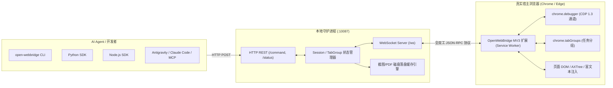

# OpenWebBridge: 现代 AI Agent 宿主寄生型原生浏览器协同框架

> **对标 Kimi WebBridge 架构，面向真实生产环境人机协同的开源 AI 浏览器代理框架。**  
> 告别隔离沙盒与 Profile 锁定，让 AI Agent 在你日常的 Chrome / Edge 浏览器中自然工作。

---

## 1. 为什么构建 OpenWebBridge？

在当前 AI 自动化浏览领域，以 **Browser-Use**（100k+ Stars）为代表的传统方案主要采用“外部独立接管模式”：
- 每次任务拉起全新的临时沙盒 Chromium；
- 无法直接复用用户日常 Chrome 的登录态（Google、GitHub、飞书、企业 SSO 等），因为 Chrome 会报 `Profile locked` 锁定冲突；
- 若强制接管已有 Chrome，必须要求用户完全退出并在终端带 `--remote-debugging-port` 参数启动；
- 严重依赖全屏 Vision 视觉大模型（大图高延迟、巨额 Token 开销）或扁平坐标点击，无法非侵入式后台运行。

**OpenWebBridge** 借鉴了企业级闭源产品 **Kimi WebBridge** 的核心设计哲学，采用 **“宿主寄生型 (Host-Parasitic) + 视觉标签组协同”** 架构：
1. **零启动摩擦**：浏览器扩展常驻用户日常 Chrome/Edge，无需杀死浏览器或带参重启。
2. **原生复用登录态**：Agent 自动拥有用户所有的会话、Cookie、2FA、企业内网权限，无需重新登录。
3. **标签页组（Tab Groups）隔离**：Agent 启动的任务自动聚拢在独立的彩色标签组下，人类一目了然，支持 `borrowed: true` 临时借调用户正在看的页面。
4. **后台静默执行**：基于 Chrome DevTools Protocol (CDP) `Emulation.setFocusEmulationEnabled`，在后台静默操作，绝不抢占操作系统全局焦点。
5. **极简无障碍语义树（AXTree）**：通过 `Accessibility.getFullAXTree` 抽取语义树并映射为紧凑的 `@e1`、`@e2` 引用，比完整 HTML DOM 节省 90% 以上 Token。
6. **富文本与复杂输入兼容**：内置富文本适配器，支持 TipTap、ProseMirror、Lexical、Notion 式 `contenteditable` 编辑器与原生表单组件。
7. **磁盘优先产物**：截图与 PDF 自动在本地磁盘落盘，仅返回文件路径，保护大模型上下文窗口不被 Base64 撑爆。

---

## 2. 系统架构



---

## 3. 快速上手

### 步骤 1：安装与启动本地守护进程 (Daemon)

```bash
# 进入 daemon 目录
cd daemon

# 安装依赖 (仅极简依赖 ws)
npm install

# 启动守护进程 (默认监听 http://127.0.0.1:10087)
node index.js start

# 或者查看运行状态
node index.js status
```

### 步骤 2：加载 Chrome / Edge 扩展

1. 打开 Chrome 或 Edge，访问 `chrome://extensions/` 或 `edge://extensions/`；
2. 开启右上角 **“开发者模式” (Developer mode)**；
3. 点击 **“加载已解压的扩展程序” (Load unpacked)**；
4. 选择本项目中的 `extension` 目录；
5. 点击扩展图标弹出面板，确认状态显示 **“已连接到 Daemon”**（绿点）。

---

## 4. 命令行 CLI 使用

本项目内置了兼容 Agent 工具调用的统一命令行工具：

```bash
# 查看连接状态
node cli/open-webbridge.js status

# 导航到新网页 (并创建分组)
node cli/open-webbridge.js navigate https://github.com --new-tab --group-title "开源调研"

# 借调用户当前正在查看的标签页
node cli/open-webbridge.js find-tab --active

# 抓取页面语义无障碍树 (@e 引用)
node cli/open-webbridge.js snapshot

# 点击特定元素 (@e 编号 或 CSS 选择器)
node cli/open-webbridge.js click "@e2"

# 向输入框或富文本编辑器写入内容
node cli/open-webbridge.js fill "@e1" "OpenWebBridge Project"

# 截图并落盘 (自动返回文件绝对路径)
node cli/open-webbridge.js screenshot ./screenshot.png

# 执行页面 JavaScript
node cli/open-webbridge.js evaluate "document.title"

# 任务结束，关闭整个标签组
node cli/open-webbridge.js close-session
```

---

## 5. SDK 快速接入

### Python SDK

```python
from sdk.python.open_webbridge import OpenWebBridge

# 初始化客户端并绑定特定任务会话
bridge = OpenWebBridge(port=10087, session="market-research")

# 1. 打开页面并设立标签组
bridge.navigate("https://news.ycombinator.com", new_tab=True, group_title="HN资讯")

# 2. 抽取极简语义树
page_state = bridge.snapshot()
print("当前页面语义元素：\n", page_state["tree"])

# 3. 点击或输入
bridge.click("@e3")

# 4. 截图并落盘为文件
shot = bridge.screenshot()
print("截图已保存至：", shot["path"])

# 5. 清理会话
bridge.close_session()
```

### Node.js SDK

```javascript
const { OpenWebBridge } = require('./sdk/node');

async function run() {
  const bridge = new OpenWebBridge({ port: 10087, session: 'my-task' });

  // 检查扩展连接状态
  const status = await bridge.status();
  console.log('Daemon 状态:', status);

  // 导航
  await bridge.navigate('https://example.com', { newTab: true, groupTitle: '测试任务' });

  // 抽取无障碍树
  const snap = await bridge.snapshot();
  console.log('无障碍树:', snap.tree);

  // 输入
  await bridge.fill('#search', 'OpenWebBridge');
}

run();
```

---

## 6. HTTP API 协议规范

### `GET /status`
返回守护进程运行状态与扩展连接信息：
```json
{
  "running": true,
  "port": 10087,
  "version": "1.0.0",
  "uptime_seconds": 128,
  "extension_connected": true,
  "extension_version": "1.0.0"
}
```

### `POST /command`
通用工具调度入口：
```json
{
  "action": "navigate",
  "args": {
    "url": "https://example.com",
    "newTab": true,
    "group_title": "调研任务"
  },
  "session": "session-123"
}
```
**成功返回：**
```json
{
  "ok": true,
  "data": {
    "success": true,
    "url": "https://example.com",
    "tabId": 101
  }
}
```
**失败返回：**
```json
{
  "ok": false,
  "error": {
    "code": "extension_not_connected",
    "message": "No browser extension is currently connected"
  }
}
```

---

## 7. 核心工具能力一览表

| 工具名称 (`action`) | 参数 (`args`) | 返回 (`data`) | 核心特性说明 |
| :--- | :--- | :--- | :--- |
| `navigate` | `url`, `newTab`, `group_title` | `{success, url, tabId}` | 自动加入 Chrome 彩色标签组；支持单页复用或并行新建 |
| `find_tab` | `url`, `active` (bool) | `{success, url, tabId, borrowed}` | `active: true` 借调用户前台正在看的页面，不扰乱用户现有标签栏 |
| `snapshot` | `interactive` (bool) | `{url, title, tree, totalElements}` | 基于 CDP `Accessibility` 构建带 `@e` 编号的无障碍语义文本树 |
| `click` | `selector` (`@e1` 或 CSS) | `{success, tag, text}` | 自动居中滚动、支持合成点击与 CDP 原生鼠标事件 |
| `fill` | `selector`, `value` | `{success, tag, mode}` | 自动区分富文本（`contenteditable` 选区注入）与原生 Input 原型赋值 |
| `screenshot` | `path`, `selector`, `quality` | `{format, path, sizeBytes, mimeType}` | 视口或元素截图，自动落盘写入临时目录或自定义目录，返回路径 |
| `evaluate` | `code` (JS 代码) | `{type, value}` | 在页面上下文中安全执行 JS 脚本 |
| `cdp` | `method`, `params` | raw CDP JSON | CDP 底层逃生舱通道（如 `Network` 抓包、`Emulation` 设备模拟等） |
| `list_tabs` | — | `{success, tabs: [...]}` | 枚举当前 Session 下受控的所有标签页 |
| `close_tab` | `tabId` (可选) | `{success, closed}` | 关闭当前标签页 |
| `close_session` | — | `{success, closed: int}` | 一键关闭该任务所属的全部标签页并解散标签组 |

---

## 8. 自动化测试验证

本项目包含完整的跨语言自动化测试套件：

```bash
# 运行完整的 9 项核心契约与协议回归测试
npm test

# 运行跨语言 (Node + Python) 集成联调测试
node tests/run_all.js
```

---

## 9. 许可证

MIT License. 欢迎社区共同扩展更多插件能力与 Agent 适配器！
